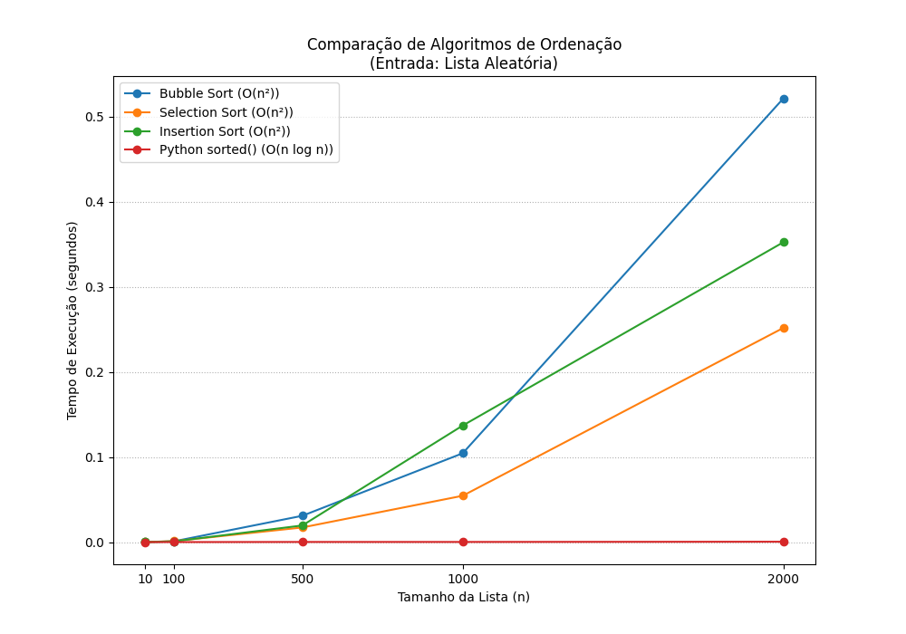

# Comparações e Ordenação em Python

Demostrações de algoritmos de ordenação e comparação utilizando Python.

## Imagens dos Testes de Comparações

Abaixo estão exemplos visuais dos testes realizados:

### Lista Crescente

### Lista Decrescente

### Lista Aleatória

## Estrutura do Projeto
- `main.py`: Arquivo principal para execução dos testes.
- `utils/`: Funções auxiliares para listas e ordenação.
- `assets/images/`: Imagens dos testes de comparação.

## Como executar
Execute o arquivo `main.py` para rodar os testes de ordenação e comparação.